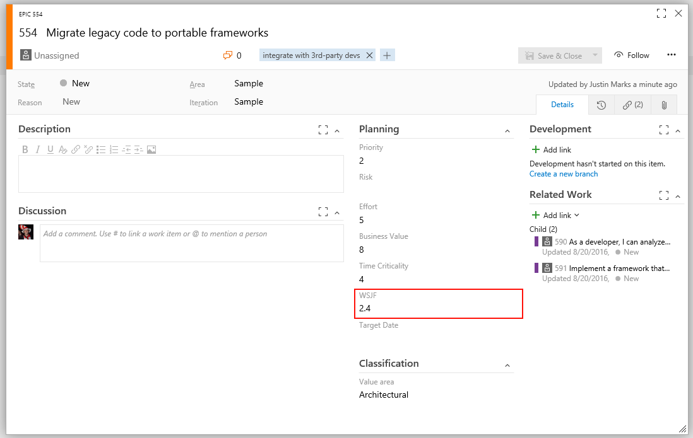
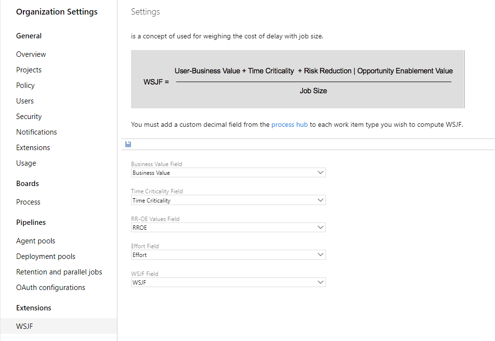

WSJF enables a **calculated field** for computing and storing WSJF on your work items.



The [Scaled Agile Framework](http://www.scaledagileframework.com) defines [WSJF (Weighted Shortest Job First)](http://www.scaledagileframework.com/wsjf/) as a calculation of cost of delay vs. job size which can help teams prioritize their portfolio backlogs with the items contributing the highest ROI.


Three values are used to calculate  WSJF:
* **Business Value**
* **Risk Reduction | Opportunity Enablement Value**
* **Time Criticality** 
* **Job Size**

# Setup
1. The first thing you need is to create the field that will store the WSJF values.  [Create a custom decimal field](https://www.visualstudio.com/en-us/docs/work/process/customize-process-field#add-a-custom-field) through the process hub and add it to the work items you want to display WSJF data on.


*NOTE: If you're using TFS onprem, you need to use witadmin to [Create a custom decimal field](https://www.visualstudio.com/en-us/docs/work/customize/add-modify-field#to-add-a-custom-field)*

2. Navigate to the "WSJF" hub on the collection settings admin experience.  From here, you must specify the fields that will be used for Business Value, Risk Reduction | Opportunity Enablement Value, Time Criticality, Job Size and WSJF.  The first three are defaulted to the fields provided out of the box by Microsoft but can be changed to custom fields if you prefer.


# Features
## Auto calculated WSJF field on the form
* WSJF is automatically updated when form is loaded.
* WSJF is automatically updated when the Business Value, Risk Reduction | Opportunity Enablement Value, Time Criticality, or Effort fields are updated.


## Recalculate WSJF context menu item
* Update WSJF for all selected work items on the backlog or query grid.


## Settings hub
* Specify which fields are used for WSJF, Business Value, Risk Reduction | Opportunity Enablement Value, Time Criticality, and Effort .


## Support
Because this extension requires the new work item form, it is only supported on VSTS and the next version of TFS (Dev15-RC1).

# Using the sample

This is an example for using relatively modern web dev technologies to build a VSTS (https://www.visualstudio.com) extension. In contrast to my other seed project and example (https://github.com/cschleiden/vsts-extension-ts-seed-simple and https://github.com/cschleiden/vsts-extension-tags-mru) which focused on simplicity, this sample aims to be more complete. It supports:

- Code written in Typescript/Styling defined using SASS
- Publishing a dev version of an extension and a production one, without changing the manifest
- Webpack for watching and building files during development, and for building optimized bundles for production
- Unit tests of the core logic using mocha/chai
- React for rendering a complex UI with user interation

## Building ##

This extension uses *webpack* for bundling, *webpack-dev-server* for watching files and serving bundles during development, *mocha*, *chai* for writing unit tests, and *karma* as a test runner.

Two bundles are defined for webpack, one for the main dialog, one for the extension context menu registration. 

All actions can be triggered using npm scripts (`npm run <target>`), no additional task runner required.  

### General setup ###

You need

* node/npm
1. Download the .zip file from the [Master Branch](https://github.com/Microsoft/vsts-wsjf-extension/archive/master.zip) 
2. Extract to a local folder on your machine 
3. Open up a command prompt (or powershell) and change directory to your root folder *(ie. C:\ ... \vsts-wsjf-extension-master)*
4. Run the command in command prompt: `npm update && npm install` 


*Note: Be sure to install npm in your root directory*

### Development (Local Instance of TFS) ###
*These are solutions for running on a local instance of TFS **only**.  If you build from these and push to a live server, they will not work*
* Run `npm run publish:dev` to publish the current extension manifest to the marketplace as a private extension with a suffix of `-dev` added to the extension id. This package will use a baseUri of `https://localhost:8080`. 
* Run `npm run dev` to start a webpack development server that watches all source files. Tests live next to product code and use a `.tests.ts` suffix instead of only `.ts`.
* To run a single test pass execute `npm run test`, to keep watching tests and build/execute as you develop execute `npm run dev:test`.

### Production (Live TFS Server) ###

*Pushing to a live TFS Server instance*

 1. Run `npm run publish:release` to compile all modules into bundles, package them into a .vsix, and publish as a *public* extension to the VSTS marketplace.
 
 *NOTE: You may get an error on the publish part, however your .vsix file should be in your root to manually upload to your TFS Server if you have not setup a marketplace*
 
 ### Adding RROE and WSJF Score Values (For Non-VSTS) ###
 
 1. Export your WorkItem.XML file *(ie. Epic.XML)* using either [Visual Studio Powertools](https://marketplace.visualstudio.com/items?itemName=VisualStudioProductTeam.ProductivityPowerPack2017) or [WITAdmin](https://docs.microsoft.com/en-us/vsts/work/customize/reference/witadmin/witadmin-import-export-manage-wits?view=tfs-2018)
 2. At the bottom of your "Fields" section add the following (Name and reference names may vary):
 
``` xml
  <FIELD name="WSJF Risk-Reduction Opportunity-Enablement" refname="WSFJ.RROEValue" type="Integer" reportable="dimension">
   <HELPTEXT> WSJF Risk-Reduction </HELPTEXT>
 </FIELD>
 
 <FIELD name="WSJF Score" refname="WSJF.Score" type="Double" reportable="dimension">
   <HELPTEXT> WSJF Score </HELPTEXT>
 </FIELD> 
```
3. Under your 
`<Form>` and `<WebLayout>` tags, choose where you would like the WSJF calculation to go and add:

```xml
<Section>
		   <Group Label="WSJF">
              <Control Label="User-Business Value" Type="FieldControl" FieldName="Microsoft.VSTS.Common.BusinessValue" EmptyText="[Numbered Value]" />
              <Control Label="Urgency/Time Criticality" Type="FieldControl" FieldName="Microsoft.VSTS.Common.TimeCriticality" EmptyText="[Numbered Value]" />
              <Control Label="Risk Reduction/Opportunity Enablement" Type="FieldControl" FieldName="WSJF.RROEValue" EmptyText="[Numbered Value]" />
			           <Control Label="Size" Type="FieldControl" FieldName="Microsoft.VSTS.Scheduling.Effort" EmptyText="[Numbered Value]" />
              <Control Label="WSJF Score" Type="FieldControl" FieldName="WSJF.Value" EmptyText="[Numbered Value]" />
     </Group>
</Section>
```
4. After this is done, open up your WSJF tab and adjust your settings:


	
	
	   
