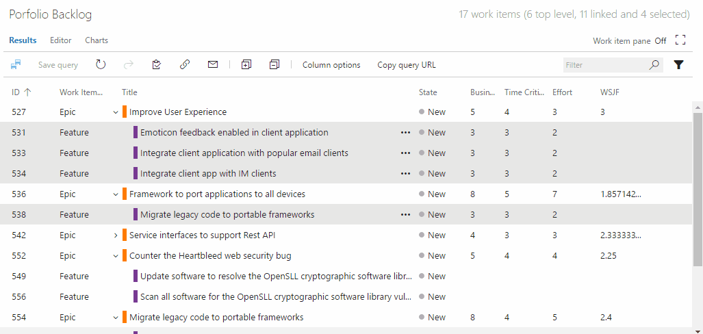

WSJF enables a **calculated field** for computing and storing WSJF on your work items.

The [Scaled Agile Framework](http://www.scaledagileframework.com) defines [WSJF (Weighted Shortest Job First)](http://www.scaledagileframework.com/wsjf/) as a calculation of cost of delay vs. job size which can help teams prioritize their portfolio backlogs with the items contributing the highest ROI.

Three values are used to calculate  WSJF:
* **Business Value**
* **Time Criticality** 
* **Job Size**

# Setup
1. The first thing you need is to create the field that will store the WSJF values.  [Create a custom decimal field](https://www.visualstudio.com/en-us/docs/work/process/customize-process-field#add-a-custom-field) through the process hub and add it to the work items you want to display WSJF data on.

*NOTE: If you're using TFS onprem, you need to use witadmin to [Create a custom decimal field](https://www.visualstudio.com/en-us/docs/work/customize/add-modify-field#to-add-a-custom-field)*
2. Navigate to the "WSJF" hub on the collection settings admin experience.  From here, you must specify the fields that will be used for Business Value, Time Criticality, Job Size and WSJF.  The first three are defaulted to the fields provided out of the box by Microsoft but can be changed to custom fields if you prefer.

# Features
## Auto calculated WSJF field on the form
* WSJF is automatically updated when form is loaded.
* WSJF is automatically updated when the Business Value, Time Criticality, or Effort fields are updated.

## Recalculate WSJF context menu item
* Update WSJF for all selected work items on the backlog or query grid.

## Settings hub
* Specify which fields are used for WSJF, Business Value, Time Criticality, and Effort .

## Support
Because this extension requires the new work item form, it is only supported on VSTS and the next version of TFS (Dev15-RC1).

# Using the sample

This is an example for using relatively modern web dev technologies to build a VSTS (https://www.visualstudio.com) extension. In contrast to my other seed project and example (https://github.com/cschleiden/vsts-extension-ts-seed-simple and https://github.com/cschleiden/vsts-extension-tags-mru) which focused on simplicity, this sample aims to be more complete. It supports:

- Code written in Typescript/Styling defined using SASS
- Publishing a dev version of an extension and a production one, without changing the manifest
- Webpack for watching and building files during development, and for building optimized bundles for production
- Unit tests of the core logic using mocha/chai
- React for rendering a complex UI with user interation

## Building ##

This extension uses *webpack* for bundling, *webpack-dev-server* for watching files and serving bundles during development, *mocha*, *chai* for writing unit tests, and *karma* as a test runner.

Two bundles are defined for webpack, one for the main dialog, one for the extension context menu registration. 

All actions can be triggered using npm scripts (`npm run <target>`), no additional task runner required.  

### General setup ###

You need

* node/npm

then just clone and execute `npm install`.

### Development ###

1. Run `npm run publish:dev` to publish the current extension manifest to the marketplace as a private extension with a suffix of `-dev` added to the extension id. This package will use a baseUri of `https://localhost:8080`. 

2. Run `npm run dev` to start a webpack developmen server that watches all source files. Tests live next to product code and use a `.tests.ts` suffix instead of only `.ts`.

3. To run a single test pass execute `npm run test`, to keep watching tests and build/execute as you develop execute `npm run dev:test`.

### Production ###

 1. Run `npm run publish:release` to compile all modules into bundles, package them into a .vsix, and publish as a *public* extension to the VSTS marketplace.